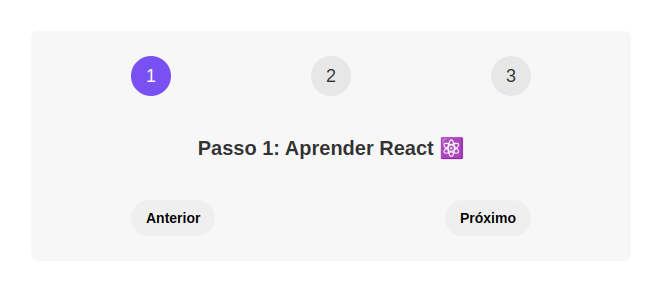
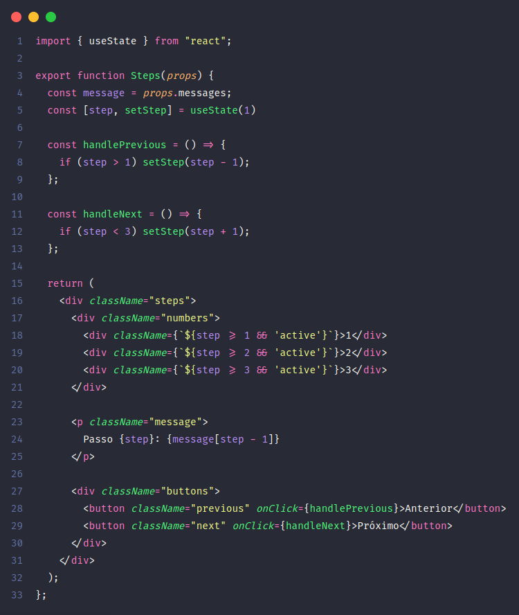

# Steps 

<h1 align="center"> 📚 Projeto de Estudo - Conceito de Estado em React</h1>

  

## Descrição 📝

Este projeto foi criado com o objetivo de estudar o conceito de estado (state) em React, um dos fundamentos essenciais dessa biblioteca JavaScript para criação de interfaces de usuário interativas. O projeto implementa um componente chamado "Steps", que simula uma interface de etapas ou passos com botões de navegação "Anterior" e "Próximo". Cada etapa exibe uma mensagem correspondente, permitindo que os usuários avancem ou retrocedam entre elas.

## Como Funciona ❓

O componente "Steps" utiliza o hook `useState` do React para gerenciar um estado local que representa a etapa atual. Através da função `setStep`, o valor da etapa pode ser atualizado, permitindo que os botões de navegação controlem a mudança entre as etapas.

  

## Funcionalidades ✨

- Exibição de uma interface de etapas ou passos com botões de navegação.
- Exibição de uma mensagem correspondente a cada etapa.
- Navegação entre as etapas utilizando os botões "Anterior" e "Próximo".

## Recursos Utilizados 🛠️

- React
- JavaScript
- HTML
- CSS

